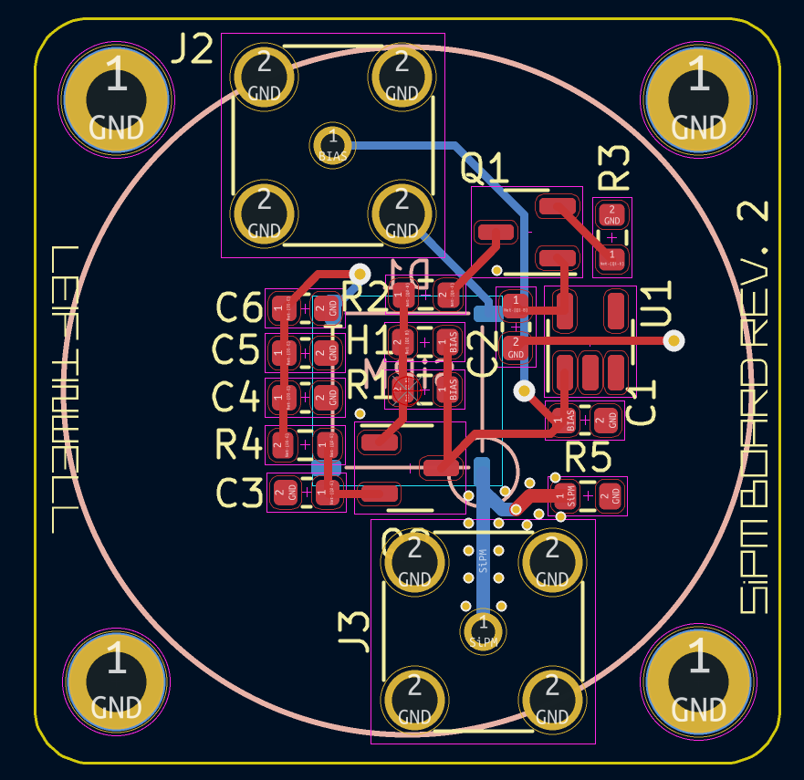

# Gamma Ray Detector

The GRD project aims to design a high performance, low cost gamma ray detector for Cubesat payload.

- [ ] [Visuals]

## Features

- [ ] [Features list]

## Hardware

- [ ] [Hardware description]

## Firmware

- [ ] [Firmware dir.]

## Authors and acknowledgment
Show your appreciation to those who have contributed to the project.

***

