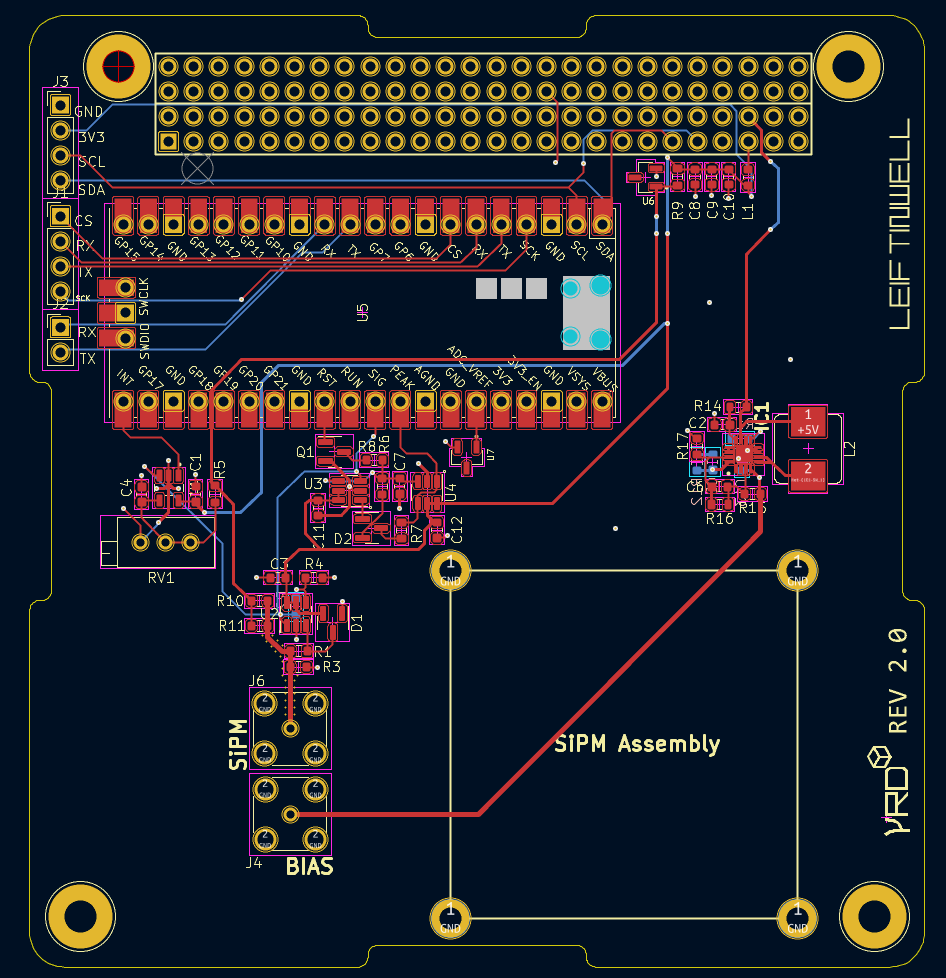

# Gamma Ray Detector

Open-source SiPM + scintillator gamma-ray detector designed for CubeSat payloads and lab use. The project refines the Pi-Pico [Open Gamma Detector] into a higher-fidelity instrument with an upgraded TIA, low-noise photodiode bias, and temperature-compensated SiPM operation.

> **Project status:** electronics and simulations complete; prototype assembly and environmental testing outstanding.

## Project output
- **Space focus:** tailored for CubeSat constraints while remaining useful on the bench.  
- **Cleaner analogue front-end:** OPA355 TIA selected for faster slew and lower noise than OPA357.  
- **Stable SiPM bias:** LT3571-based photodiode bias supply with low ripple and temperature compensation strategy.  
- **Thermal robustness:** overvoltage held constant vs temperature to stabilise SiPM gain/PDE.

---

## High-level objectives

1. Develop a CubeSat-compatible system by enhancing the Pi-Pico DIY detector  
2. Build a working prototype  
3. Test detection performance and space suitability

## Architecture

- [visual diagram]

- [ ] [Visuals]

## Features

- [ ] [Features list]

## Hardware

- [ ] [Hardware description]

## Firmware

- [ ] [Firmware dir.]

## Authors and acknowledgment

If you use this project in academic work, please cite the MSc thesis and this repository:
Tinwell, L. (2023). Gamma Ray Detector (MSc Thesis, University of Surrey).

***

